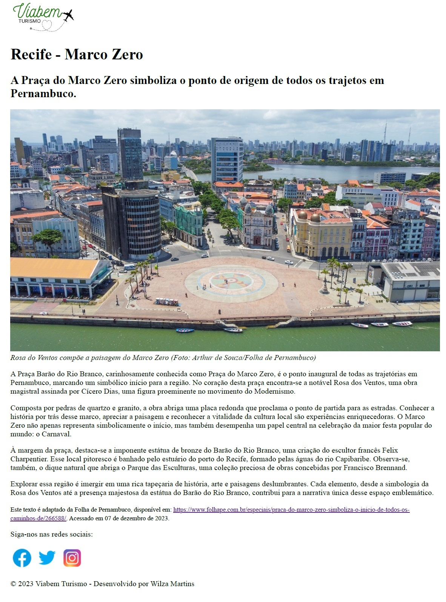

# desenvolvimento3_95844
Atividade do curso HTML/CSS

A cidade do Recife é uma das mais famosas do Nordeste, ela possui diversos pontos turísticos e um deles é o Marco Zero. Sabendo disso, crie uma página HTML, falando sobre esse ponto turístico de acordo com os seguintes pré-requisitos: 

 1. A página precisa ter cabeçalho, conteúdo e rodapé;
 2. A página precisa ter imagens; 
 3. Use a tag de semântica textual inline. 

 Abuse de sua criatividade para a criação da página! 

 Página criada:

 

# desenvolvimento4_95848
Atividade do curso HTML/CSS

Com a página sobre o Marco Zero feita, é necessário de uma outra página e de um link que leve até ela. Na nova página, fale sobre dois outros pontos turísticos do Recife Antigo e siga os pré-requisitos a seguir:

1. Crie um link que irá direcionar para essa nova página;
2. Adicione imagens sobre os lugares.

Veja o resultado [clique aqui]( https://wilzamartins.github.io/desenvolvimento3_95844/)

 

